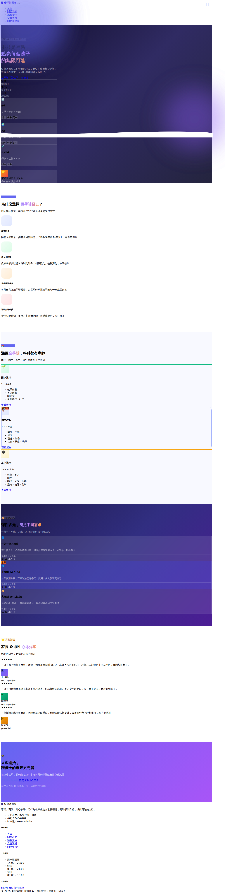

# 優學補習班 — 補習班網站

一個完整的補習班靜態網站，使用 Bootstrap 5 設計，包含課程介紹、費用說明、文宣資料與報價單功能。

## 首頁預覽



## 頁面說明

| 頁面 | 檔案 | 說明 |
|------|------|------|
| 首頁 | `index.html` | 英雄區塊、課程特色、師資介紹、學生心聲 |
| 關於我們 | `about.html` | 教學理念、授課方式、學習流程、師資陣容 |
| 課程費用 | `pricing.html` | 國小/國中/高中費率表、優惠方案、FAQ |
| 文宣資料 | `promotions.html` | 最新公告、優惠活動、資料下載、報名方式 |
| 開立報價單 | `quote.html` | 互動式報價單，可預覽並列印為 PDF |

## 技術規格

- **框架**：Bootstrap 5.3.3 + Bootstrap Icons 1.11.3
- **字型**：Noto Sans TC（Google Fonts）
- **語言**：HTML / CSS / 原生 JavaScript（無後端）
- **報價計算**：國小 NT$600/hr、國中 NT$700/hr、高中 NT$800/hr（個人教學）；3 個月 9.5 折、6 個月 9 折

## 本地執行

```bash
python3 -m http.server 8090
# 開啟 http://localhost:8090
```
